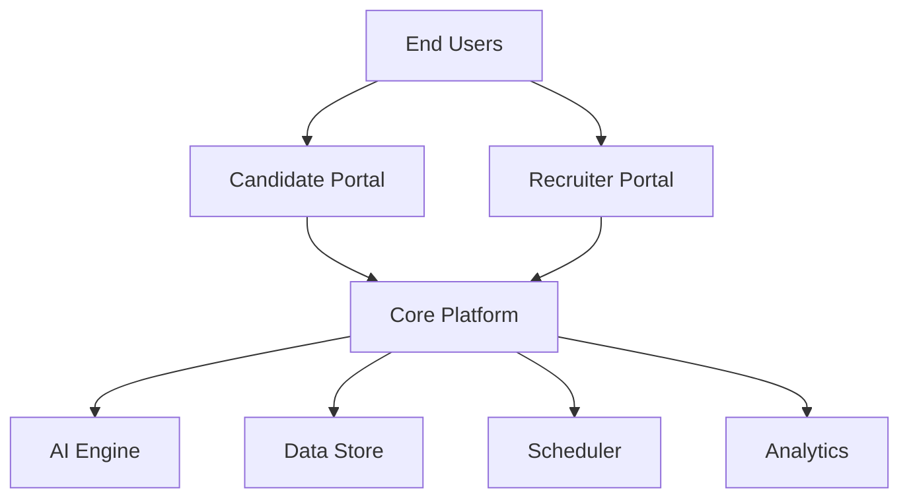

# Project Consulting Report

_Generated on 2026-06-15 11:54_

---

## 1. Executive Summary

The project aims to replace outdated, spreadsheet‑driven recruitment processes with a cloud‑native SaaS recruitment platform built on Microsoft Azure. The solution will provide end‑to‑end job and candidate management, AI‑powered resume parsing, searchable candidate data, automated interview scheduling, and comprehensive dashboards for recruiters, hiring managers, and executives. Key decisions include using Azure AD Entra ID for SSO, .NET 8 APIs on Azure App Service, React SPA via Azure Static Web Apps, and Azure AI services for parsing and search. The recommendation is to proceed with a phased MVP that delivers core recruiting functionality within the six‑month timeline while deferring advanced analytics and optional services to later phases.

---

## 2. Background Summary

The client currently manages recruitment across 35 countries with 28,000 employees using a mix of Workday, Excel, and SharePoint, resulting in fragmented data, duplicate effort, and prolonged time‑to‑hire. Manual processes such as resume review, interview scheduling, and status communication are causing high costs, candidate dissatisfaction, and low recruiter trust in existing systems.

---

## 3. Problem / Need Analysis

| Problem / Need | Business Impact |
| --- | --- |
| Recruitment processes have not evolved in eight years despite growth across 35 countries and 28,000 employees. | Inefficient hiring leads to higher operational costs, delayed time‑to‑fill, and reduced competitiveness. |
| Many teams still maintain candidate data in Excel sheets, leading to fragmented information. | Data inconsistency hampers decision‑making and creates duplicate effort across regions. |
| Lack of a single source of truth causes confusion when status updates are requested. | Stakeholders experience delays and mistrust, increasing time‑to‑hire and administrative overhead. |
| Recruiters use inconsistent tools (Workday, Excel, SharePoint) resulting in duplicated effort. | Redundant work reduces recruiter productivity and inflates hiring costs. |
| An engineering role remained open for three months and over 600 applications were never reviewed. | Lost talent and prolonged vacancy drive project delays and revenue impact. |
| High application volume (up to 2,000 per role) forces manual resume review and an inconsistent screening process. | Recruiter overload leads to missed strong candidates and longer hiring cycles. |
| Recruiters miss strong candidates because they are overwhelmed by the volume of applications. | Quality of hires declines, affecting team performance and retention. |
| Vacant positions, delayed hiring, and administrative work all incur significant costs. | Direct financial impact through overtime, external agency fees, and lost productivity. |
| Recruiters do not trust the data in Workday, viewing it as a process issue. | Low adoption of existing HR tools leads to parallel processes and data silos. |
| Repetitive tasks such as interview scheduling, resume reviewing, updates, status tracking, and feedback collection consume excessive time. | Administrative burden reduces time spent on strategic talent acquisition activities. |
| Interview scheduling currently relies on manual Outlook email coordination. | Scheduling delays and errors increase time‑to‑hire and candidate frustration. |
| Candidates often feel ignored due to lack of communication during the hiring process. | Negative candidate experience harms employer brand and reduces offer acceptance rates. |
| Concern that a new solution might be impressive but not adopted, leading users back to spreadsheets. | Failed investment and continued inefficiencies if user adoption is low. |
| Need to reuse existing Microsoft investments and avoid unnecessary complexity within budget constraints. | Ensures cost‑effective implementation and alignment with corporate IT strategy. |
| Six‑month timeline for MVP is considered ambitious and requires controlled scope. | Scope creep could jeopardize delivery dates and ROI expectations. |

---

## 4. Requirements Analysis

### Functional Requirements

| ID | Requirement |
| --- | --- |
| FR-001 | Provide job management capabilities. |
| FR-002 | Provide candidate management capabilities. |
| FR-003 | Allow resume upload and parsing. |
| FR-004 | Enable candidate search across uploaded resumes. |
| FR-005 | Offer recruiter dashboard with relevant metrics. |
| FR-006 | Offer hiring manager dashboard. |
| FR-007 | Automate interview scheduling. |
| FR-008 | Send notifications to relevant users. |
| FR-009 | Deliver analytics and reporting features. |
| FR-010 | Support executive dashboards with metrics such as time‑to‑hire, time‑to‑fill, recruiter productivity, candidate funnel, offer acceptance rates, department and regional performance, hiring costs, diversity metrics, candidate satisfaction, recruiter workload, and sourcing effectiveness. |
| FR-011 | Implement single sign‑on integrated with Microsoft Entra ID. |
| FR-012 | Record detailed audit logs of all candidate data accesses and changes. |
| FR-013 | Enforce role‑based access control with distinct permissions for recruiters, hiring managers, department heads, HR business partners, executives, candidates, system administrators, and external interviewers. |
| FR-014 | Integrate with Workday for core HR data. |
| FR-015 | Integrate with Microsoft Teams for collaboration. |
| FR-016 | Integrate with Outlook Calendar for interview scheduling. |
| FR-017 | Provide a candidate portal where candidates can track applications, schedule interviews, upload documents, receive notifications. |

### Non-Functional Requirements

| Category | Requirement |
| --- | --- |
| Performance | Resume parsing must complete within 10 seconds; candidate search responses must be under 2 seconds. |
| Scalability | System must handle peak loads of up to 2,000 concurrent applications per role and scale horizontally across Azure regions. |
| Security | All data in transit and at rest must be encrypted; Azure AD Entra ID SSO with MFA and RBAC enforced; audit logs immutable for compliance. |
| Availability | 99.9% service availability using Azure Front Door and Traffic Manager across multiple regions. |
| Maintainability | Infrastructure defined as code (Bicep/ARM) with automated CI/CD pipelines for repeatable deployments. |

### Constraints

### Business Goals

### Technology Context

| Technology Context |
| --- |
| Preferred Cloud: Azure |
| Existing CRM: Salesforce |

---

## 5. Assumptions

| Assumption |
| --- |
| Azure subscription is available and provisioned. |
| Client will provide API credentials for third‑party integrations. |
| Existing infrastructure remains unchanged during the POC phase. |

---

## 6. Feature & Module Breakdown

| Module | Feature / Functionality | Technologies Used |
| --- | --- | --- |
| Frontend | React single‑page applications for recruiter and candidate portals providing UI for job posting, candidate tracking, dashboards, and scheduling. | React SPA, Azure Static Web Apps, Azure AD Entra ID SSO |
| Backend API | RESTful services handling business logic, data validation, and orchestration of integrations. | .NET 8 ASP.NET Core, Azure App Service (Linux) |
| Database | Transactional storage for jobs, candidates, applications, audit logs, and reference data. | Azure SQL Database Managed Instance |
| Search | Semantic search over parsed resume content and candidate profiles. | Azure AI Search |
| Storage | Secure blob storage for raw resumes and supporting documents. | Azure Blob Storage (Hot tier) |
| Resume Parsing | AI‑driven extraction of structured candidate data from uploaded documents. | Azure AI Document Intelligence (Form Recognizer) + Azure AI Language (Text Analytics) |
| Integration Layer | Connectivity to Workday, Outlook Calendar, Teams, and SharePoint for data sync and workflow automation. | Azure Logic Apps + Microsoft Graph connectors |
| Messaging Queue | Asynchronous processing of parsing jobs, notifications, and audit events. | Azure Service Bus (Standard tier) |
| Notification Service | Real‑time alerts via email, push, and Teams bot. | Azure Notification Hubs, SendGrid, Teams bot via Graph |
| Caching | Fast access to session state and frequently‑queried reference data. | Azure Cache for Redis |
| Monitoring & Observability | Logging, performance metrics, and audit trail collection. | Azure Monitor, Application Insights, Log Analytics |
| CI/CD & IaC | Automated build, test, and deployment with infrastructure as code. | Azure DevOps Pipelines, Bicep/ARM templates |
| Governance & Security | Secret management, policy enforcement, and optional security operations. | Azure Key Vault, Azure Policy, Azure Sentinel (optional) |
| Analytics & Reporting | Embedded Power BI dashboards for recruiter, hiring‑manager, and executive insights. | Power BI Embedded, Azure SQL |

---

## 7. Final Solution Architecture

---

## 8. Feasibility Assessment

| Metric | Value | Reason |
| --- | --- | --- |
| Complexity | Very High | Broad set of Azure services introduces significant implementation complexity for a six‑month MVP. |
| Architecture Confidence | Medium | Design is technically sound and aligns with Azure‑first mandate, but integration breadth creates risk. |
| Feasibility Confidence | Medium | Scope and schedule are aggressive; may exceed typical team capacity without scope reduction. |

---

## 9. Risk Assessment

| Risk | Impact | Mitigation Strategy |
| --- | --- | --- |
| Workday integration via Logic Apps may require custom connectors or complex authentication handling, risking delays and data inconsistency. | Integration failures could block core job and candidate data sync, jeopardizing the MVP timeline and causing inaccurate recruiter dashboards. |  |
| AI‑based resume parsing and Azure AI Search may experience variable latency or throttling under peak loads, breaching the 10‑second parsing and 2‑second search SLAs. | Slow parsing or search responses will degrade recruiter productivity and candidate experience, potentially violating performance commitments. |  |
| The extensive set of Azure services (Front Door, Traffic Manager, Redis, Power BI Embedded, etc.) adds operational and DevOps complexity that may exceed the team's skill set within six months. | Complex deployment pipelines and environment management could cause schedule slippage, configuration drift, and higher operational costs. |  |
| Storing candidate resumes globally may conflict with GDPR data‑residency requirements across 35 countries. | Non‑compliance could result in legal penalties and loss of trust among European users. |  |

---

## 10. Recommendations & Next Steps

Begin with a sprint‑0 kickoff to finalize scope, confirm Azure subscriptions, and establish the core DevOps foundation (IaC, CI/CD pipelines, and Entra ID configuration). Form a cross‑functional delivery team comprising a product owner, Azure‑experienced architects, .NET backend developers, React front‑end engineers, and a QA lead. Deliver the MVP in three incremental releases: (1) Core job and candidate data model with Azure SQL and basic CRUD APIs; (2) Recruiter portal UI, resume upload, and asynchronous parsing pipeline; (3) Interview scheduling integration with Outlook/Teams and basic dashboards. Target key milestones at the end of months 2, 4, and 6, with a go‑live gate after the third release. Capture user feedback early to prioritize deferred features such as advanced AI Search and Power BI analytics for the post‑MVP roadmap.

---

## 11. Architecture Summary

The Azure‑first, cloud‑native architecture was chosen to leverage the client’s existing Microsoft investment, meet global availability requirements, and provide a secure, compliant foundation. Azure AD Entra ID delivers unified SSO and granular RBAC, while Azure SQL Managed Instance ensures relational consistency for core HR data. AI services (Document Intelligence and AI Search) deliver the required resume parsing and semantic search capabilities, and Logic Apps orchestrate integrations with Workday, Teams, and Outlook. This combination satisfies functional and non‑functional goals—performance, scalability, security, and maintainability—while aligning with budget and timeline constraints through modular, IaC‑driven deployment.

---

## 12. Final Solution Architecture

