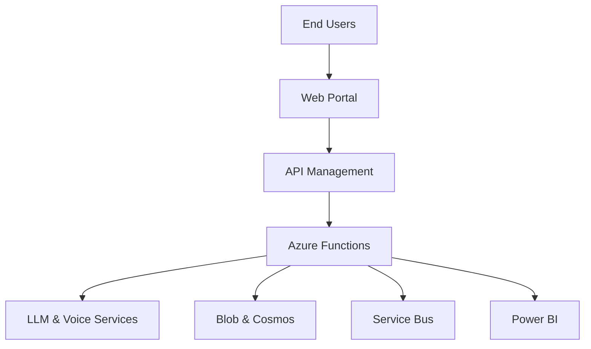

# Project Consulting Report

_Generated on 2026-06-15 17:28_

---

## 1. Executive Summary

The project aims to deliver a multi‑tenant, white‑label SaaS platform that provides AI‑powered conversational role‑play training for retail sales associates. By leveraging Azure serverless services, OpenAI language models, and 11 Labs voice synthesis, the solution will enable scalable, real‑time coaching, automated scoring, and reporting that links practice activity to sales performance. Key decisions include an Azure‑centric architecture with React front‑end, Azure Functions backend, and Cosmos DB for multi‑tenant data isolation, all within a constrained MVP budget of $500‑800 K and a tight pilot timeline. The recommendation is to proceed with the proposed architecture, focusing on rapid MVP delivery for 73 pilot stores, followed by phased enhancements and cloud‑agnostic extensions.

---

## 2. Background Summary

The client currently relies on limited in‑person training, where a single trainer supports 135 stores, resulting in inconsistent role‑playing experiences and insufficient coaching capacity. Associates have only brief daily windows for practice, and existing off‑the‑shelf tools fail to meet defined KPIs, lacking integration with POS data and white‑label capabilities.

---

## 3. Problem / Need Analysis

| Problem / Need | Business Impact |
| --- | --- |
| Current training is limited because only one person can train 135 stores, leading to inconsistent role‑playing. | Inconsistent training reduces associate skill development, leading to lower conversion rates and missed revenue opportunities. |
| Many stores lack expert staff to conduct role‑play sessions, creating gaps in coaching. | Coaching gaps increase turnover and diminish customer experience quality, impacting brand reputation. |
| Sales associates have only 3‑5 minutes per day for practice due to time constraints on the sales floor. | Limited practice time hampers skill reinforcement, resulting in sub‑optimal sales performance. |
| Off‑the‑shelf tools do not meet all defined KPIs and require workarounds. | Workarounds increase operational overhead and prevent accurate measurement of training effectiveness. |
| There is no integration with POS systems, making it difficult to link training outcomes to sales data. | Inability to correlate training with sales data obscures ROI and makes it hard to justify training investments. |
| Rapid evolution of AI technology creates uncertainty about future support and maintenance. | Future‑proofing risk may lead to costly re‑engineering or loss of competitive advantage. |
| The client needs to keep development costs low while delivering a functional MVP. | Budget overruns could jeopardize project approval and delay time‑to‑value. |
| Uncertainty about the client’s cloud environment (Azure vs AWS) adds planning complexity. | Potential cloud‑vendor lock‑in could limit scalability and increase migration costs later. |
| Manual data comparison is required for effectiveness metrics due to lack of automated integration. | Manual effort reduces insight speed and increases risk of inaccurate reporting. |
| Without a white‑label solution, duplicating the tool across multiple partner accounts would be inefficient. | Inefficient duplication raises operational costs and limits market expansion opportunities. |

---

## 4. Requirements Analysis

### Functional Requirements

| ID | Requirement |
| --- | --- |
| FR-001 | The platform must provide an AI‑powered conversational interface for sales role‑play training. |
| FR-002 | It must allow upload and management of training content such as brochures, PowerPoint decks, and pitch scripts. |
| FR-003 | The solution should support voice interaction using OpenAI for language modeling and 11 Labs for voice synthesis. |
| FR-004 | It must generate real‑time scoring and feedback during role‑play sessions. |
| FR-005 | Each role‑play interaction must be recorded and stored as a transcript for manager review. |
| FR-006 | The system should track practice frequency and score improvement for each associate. |
| FR-007 | It must provide reporting that links training activity to attach‑rate uplift in sales data. |
| FR-008 | Managers need the ability to add notes, adjust scoring, and fine‑tune AI recommendations. |
| FR-009 | The platform should allow configuration of difficulty levels and objection‑handling scenarios. |
| FR-010 | It must be delivered as a white‑label SaaS solution that can be duplicated across multiple partner accounts. |
| FR-011 | The MVP should support multi‑tenant access for approximately 73 pilot stores initially. |
| FR-012 | Manual comparison metrics are required for the MVP without POS integration. |
| FR-013 | The solution must enable export or viewing of reports at both individual associate and store levels. |

### Non-Functional Requirements

| Category | Requirement |
| --- | --- |
| Performance | User interfaces and conversational turns shall respond within 2 seconds under normal load. |
| Security | All data at rest and in transit must be encrypted; strict tenant isolation enforced; compliance with ISO 27001/SOC 2. |
| Scalability | Platform must scale to support 100+ stores and additional tenants without performance degradation. |
| Availability | Target 99.9% uptime using Azure managed services and automated failover. |
| Maintainability | Codebase modularized with CI/CD pipelines to allow automated testing, deployments, and quick iteration. |

### Constraints

| Constraint |
| --- |
| The MVP budget is limited to $500‑800 K. |
| A pilot must be ready before October, with test stores active by the end of June. |
| No POS integration is planned for the initial proof of concept. |
| The client expects proposal submissions by the end of next week and a decision after internal review. |
| The client requires ownership of the IP so the solution can be white‑labelled and marketed to other partners. |
| The client’s cloud provider has not been confirme |

### Business Goals

### Technology Context

| Technology Context |
| --- |
| Preferred Cloud: Azure |
| Existing CRM: Salesforce |

---

## 5. Assumptions

| Assumption |
| --- |
| Azure subscription is available and provisioned. |
| Client will provide API credentials for third‑party integrations. |
| Existing infrastructure remains unchanged during the POC phase. |

---

## 6. Feature & Module Breakdown

| Module | Feature / Functionality | Technologies Used |
| --- | --- | --- |
| Frontend | Responsive UI for scenario selection, real‑time interaction, dashboards and reporting. | React 18 hosted on Azure Static Web Apps |
| Backend API | REST/GraphQL endpoints for content management, scoring, transcript storage, and reporting. | Azure Functions (Node.js 20) |
| Authentication | Multi‑tenant user management, JWT issuance, password reset. | Azure AD B2C, Azure Key Vault |
| API Gateway | Routing, throttling, tenant isolation policies. | Azure API Management (Developer tier) |
| Storage | Persistent storage for PDFs, PPTX, audio recordings, transcripts. | Azure Blob Storage (Cool tier) |
| Database | Multi‑tenant user profiles, scores, notes, session metadata. | Azure Cosmos DB (Core (SQL) API) |
| Search | Semantic search over uploaded training content for contextual AI retrieval. | Azure Cognitive Search |
| Message Queue | Asynchronous processing of content ingestion, scoring pipelines, and report generation. | Azure Service Bus (Standard tier) |
| CI/CD | Automated build, test, and deployment for both Azure and potential AWS targets. | Azure DevOps Pipelines (YAML) |
| Monitoring | Telemetry, health checks, usage analytics, alerting. | Azure Monitor + Application Insights |
| Reporting | Manager dashboards, exportable CSV/Excel reports at associate and store levels. | Power BI Embedded (shared capacity) |
| Voice Synthesis Integration | Generate realistic voice responses for role‑play scenarios. | 11 Labs Voice Generation API (HTTPS calls) |
| Speech‑to‑Text | Transcribe associate speech to text for scoring and storage. | Azure Speech Service (Speech‑to‑Text) |

---

## 7. Solution Architecture

---

## 8. Feasibility Assessment

| Metric | Value | Reason |
| --- | --- | --- |
| Complexity | High | Multi‑tenant architecture, AI integration, and tight timeline increase development complexity. |
| Architecture Confidence | High | Proven Azure services and design alignment with client constraints give strong confidence. |
| Feasibility Confidence | Medium | Budget and timeline constraints require careful cost monitoring and performance validation. |

---

## 9. Risk Assessment

| Risk | Impact | Mitigation Strategy |
| --- | --- | --- |
| Cost overruns from Cosmos DB provisioned throughput and Power BI Embedded usage as interaction volume grows. | Budget could exceed the $500‑800 K limit, jeopardizing project approval. |  |
| High latency in the voice pipeline (speech‑to‑text → LLM → text‑to‑speech) causing poor real‑time trainer experience. | Associates may abandon practice sessions, reducing training effectiveness and ROI metrics. |  |
| Insufficient tenant data isolation in Cosmos DB partitions and API Management policies leading to cross‑tenant data leakage. | Compliance breach (ISO 27001/SOC 2) and loss of partner trust, potentially derailing the white‑label business model. |  |
| Dependency on Azure OpenAI service; if the client later selects AWS, fallback to OpenAI API may introduce inconsistencies and additional licensing costs. | Potential vendor lock‑in and increased operational complexity for a multi‑cloud rollout. |  |

---

## 10. Recommendations & Next Steps

Begin immediate onboarding of a cross‑functional delivery team comprising a solution architect, senior developers (frontend and backend), DevOps engineer, and QA lead. Prioritize provisioning of Azure resources (AD B2C, Cosmos DB, API Management) and setting up CI/CD pipelines within the next two weeks. Deliver the MVP core flow—authentication, content upload, voice‑enabled role‑play, real‑time scoring, and transcript storage—by the end of June to meet the pilot rollout deadline. Conduct weekly cost‑monitoring reviews and performance tests to stay within the $500‑800 K budget and latency targets. After the pilot, plan phased enhancements: POS data integration, expanded tenant isolation, and migration to AWS using the existing IaC abstractions.

---

## 11. Architecture Summary

The Azure‑centric, serverless architecture was chosen because it offers built‑in AI services, multi‑tenant data isolation, and pay‑as‑you‑go pricing that align with the client’s low‑budget, fast‑time‑to‑market goals. React on Azure Static Web Apps provides a lightweight, cost‑effective UI, while Azure Functions deliver scalable compute for conversational flows and scoring. Cosmos DB and Azure Blob Storage ensure secure, isolated storage for each tenant’s data, and API Management provides a single, governed entry point essential for a white‑label SaaS offering. Together these components satisfy functional and non‑functional requirements while remaining flexible for future cloud‑agnostic expansion.
